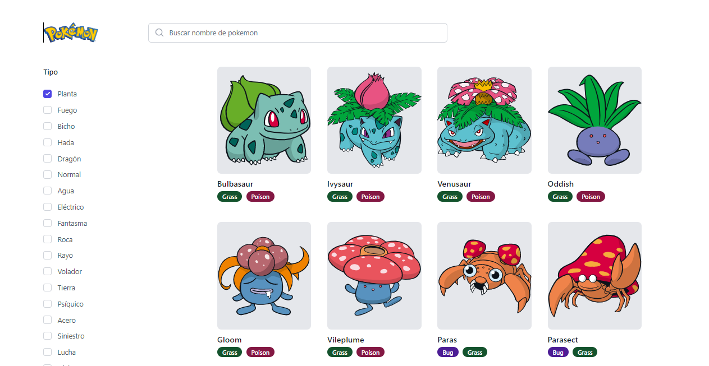
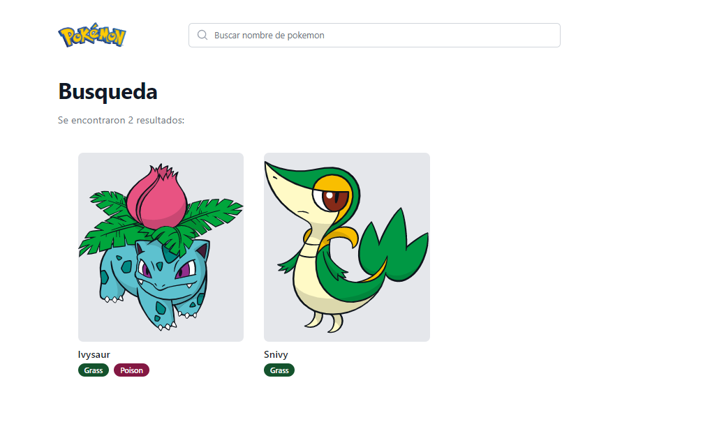
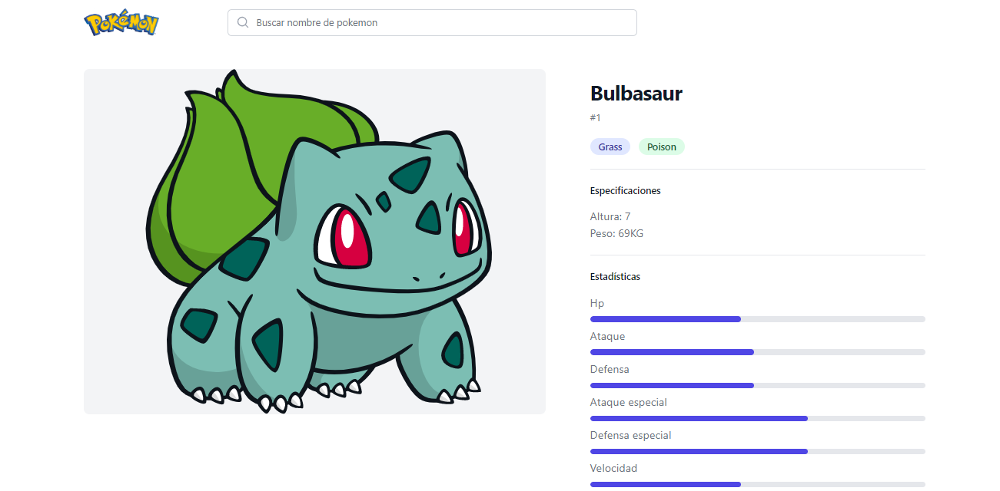

# Pokedex - ReactJS

## 📷 Screenshot

  

  

  

## 📝 Project Description

The Pokédex project allows users to view the list of Pokémon, search, filter and view the details of the specified Pokemon from the PokéAPI.

- React 18
- React Context
- Custom Hooks
- Responsive design

## 📚 Technologies

- [ReactJS](https://reactjs.org/)
- [Tailwind](https://tailwindcss.com/)
- [React Router](https://reactrouter.com/)
- [Vite](https://vitejs.dev/)
- [API: PokéAPI](https://pokeapi.co/)
